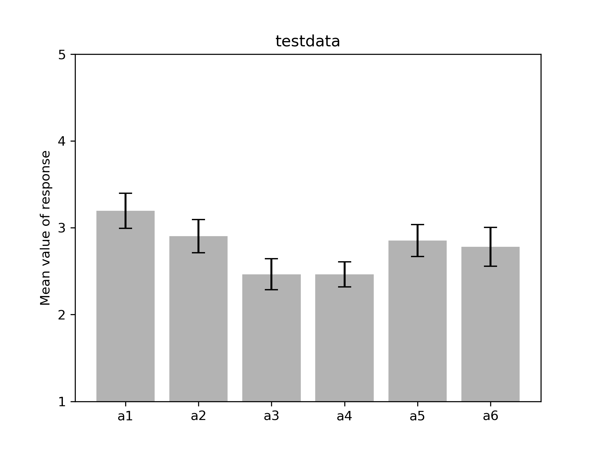

# Exp_DataSort

## 動作環境

- Python3.6以上
- numpy
- pandas

autoplot.pyではmatplotlibも必要

## sort.pyについて

### 使い方
1. スクリプトを実行したら，以下のような画面が出てくる
2. __Choose target directory__を選択して，変換したいCSVが入ったフォルダを選択する
3. __CONVERT__を押すと，選択したフォルダ内に並び替え後のcsvが作成される

### 注意点
- スクリプトはGoogle Formで作成されたアンケート結果をCSV形式でダウンロードしたものを対象とする前提でできている
	- よって，その他の形式で作成した場合は，
		- レイアウトは，1行目が質問内容，1列目がタイムスタンプ，2列目が被験者番号となるようにする
		- 極力日本語（2バイト文字）の入力を避け，全て英数字で回答を入力するようにする
		- アンケートフォーム（結果）は条件ごとに作成する（6条件の場合，アンケートは6つ）
- Google Formを使った場合も，上記の注意点に気をつける必要がある
	- 条件ごとにフォームを用意する
	- 各フォームの冒頭で被験者番号を入力させる
	- 事前に日本語の回答をクリーニングしておく
		- 例えば，五段階評価は数字に直しておく，選択肢問題はアルファベットにしておく，など
- 2バイト文字が回答としてあった場合，できあがりのCSVファイルをエクセルで表示すると文字化けする
	- sublime textなどのエディタで見ると，きちんと表示される可能性がある
- もしも被験者番号を聞かなかった場合，__Subject' ID__のチェックを外しておく	

## autoplot.pyについて

### 使い方
1. スクリプトを起動したら，以下のような画面が出てくる
2. __Choose Target directory__を押して，プロットしたいデータが入ったディレクトリを選ぶ
	- CSVファイル単位で指定したい場合は，__Choose target CSV/TSV-file__を選択する
	- __Choose Target directory__/__Choose target CSV/TSV-file__から読み込みフォルダ/ファイルを指定した場合は，__Target directory__/__Target CSV/TSV-file__のラジオボタンは自動で切り替わる
		- 自分でパスを入力した場合は，ラジオボタンを選択して切り替えること
3. 誤差棒をSEM（標準誤差）/SD（標本標準偏差）にするのか選択する（defaultはSEM）
4. ファイルにヘッダーとインデックスが含まれない場合は，__Header__と__Index__のチェックを外す
	- sort.pyでデータを作成した場合は，両方にチェックを入れておく（default）
5. （任意）__N of Factor A__から__N of Factor D__までに適切な要因数を入れる
	- エラーがあった場合，条件名はプロットされない
6. （任意）__Maximum value of response__と__Minimum value of response__を指定する
	- 両方が整数だった場合，1刻みでy軸の目盛りがプロットされる
7. （任意）__Y-label of graph__にy軸のタイトルを入力する
8. （任意）__CSV/TSV's name to Title of graph__にチェックを入れると，読み込んだファイル名がグラフのタイトルとしてグラフ上部に表示される
8. __Capsize of error-bar__で誤差棒のキャップサイズを指定する（defaultは5）
9. __X ticks' rotation__で条件名プロットの角度を指定する（defaultは0）
10. __Drawing Graph__でグラフ描画

### 注意点
- sort.pyで作成したデータを対象として，___平均値の比較のグラフ___を描画することを目的としている
	- 選択肢問題については対応不可
	- 自作のデータの場合，1列目はヘッダー，1行目はインデックスとする
		- つまり，2列目2行目からデータが始まる
		- ヘッダーは各条件，インデックスは各被験者を表すようなデータ配列にする		
- プロットを表示して問題なければ，__Save Figure__にチェックを入れて実行すると，表示せずに保存する
	- ファイル名は，読み込んだCSVファイルと同じ名前でPNG形式で同じ場所に保存される（dpi=300）

### testdata
以下，`testdata_autoplot/testdata.csv`をプロットした結果

